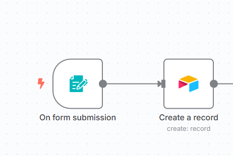

# Form-to-Airtable Workflow

## Purpose
This workflow logs response to airtable base once user submits the form.

## Trigger
- Custom Form 

## Nodes Used
- On Form Submission: Checks for form submission event
- Create a record: craetes a record in airtable specified table and base. 

## Screenshot

