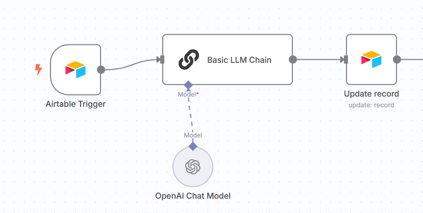

# Airtable Review Sentiment Analysis Workflow

## Purpose
This workflow monitors Airtable for new review entries, sends each review to the OpenAI API via a Basic LLM Chain and OpenAI Chat Model for sentiment analysis, and updates the Airtable record with the sentiment classification (positive, negative, or neutral).

## Trigger
- New review entry in Airtable

## Nodes Used
- **On New Airtable Record:** Detects new review entries in the specified Airtable table and base.
- **Basic LLM Chain:** Handles data flow and prompt construction between Airtable and the AI model.
- **OpenAI Chat Model:** Processes the review text to determine sentiment using OpenAI's chat-based language model.
- **Update Record:** Updates the same Airtable record with the sentiment result (positive, negative, or neutral).

## Screenshot

